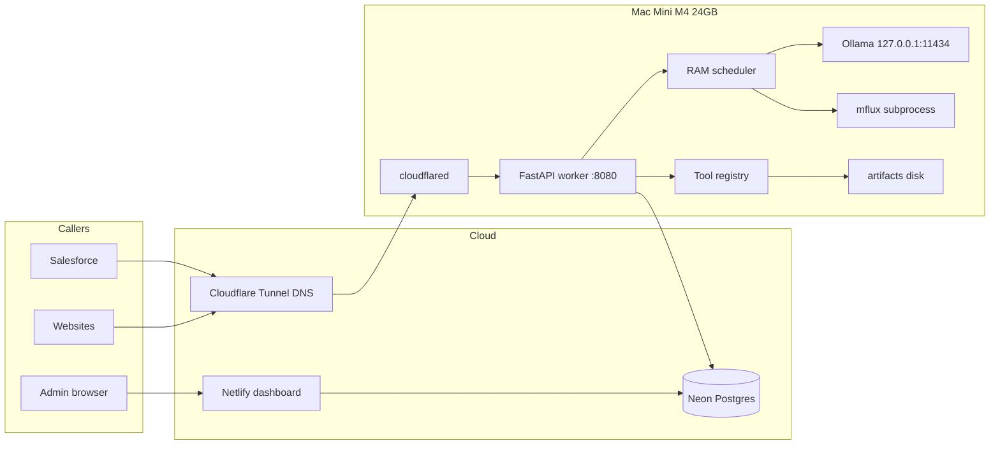

# Cloudiator production plan

**Product name:** Cloudiator (repo `cldM4`)  
**Hardware:** Apple Mac Mini M4, 24GB unified memory  
**Git:** https://github.com/AshrafRezk/cldM4.git  
**Status:** Plan only. Implement on the Mini, one phase at a time.  
**Video:** out of v1.

This file is the source of truth. If Cursor on the Mini disagrees with a blog post, **this file wins**.

---

## 0. How to execute this plan (read first)

Clicking **Build** in the original planning chat would have started coding on **that** computer, not “finish the plan.” The plan is this git repo.

On the Mac Mini:

1. Install Cursor **Pro Plus**. Clone `https://github.com/AshrafRezk/cldM4.git`.
2. Open **this folder** as the workspace. Apply [docs/cursor-settings.md](docs/cursor-settings.md) (Privacy Mode, Auto **off**, Claude Opus 5 for A/B/D/E, no auto-run terminal).
3. New **Agent** chat. Model = Opus 5. Attach `@PLAN.md`. Paste the prompt for **Phase A only** from [docs/cursor-phases.md](docs/cursor-phases.md).
4. When Phase A definition of done is green, commit, **new chat**, then Phase B, and so on.
5. Never ask one chat to “build the whole product.” Context and RAM on the Mini will thrash.
6. Project rule `.cursor/rules/cloudiator.mdc` must stay Always-on.

Do **not** implement from a laptop and expect Metal/Vision/Ollama to be production-tested. You may write TypeScript dashboard code anywhere; **worker + models + LaunchAgents must be verified on the Mini.**

---

## 1. Product thesis

Cloudiator looks like a private OpenAI:

- Each Salesforce org or website gets an API **link** (base URL + `sk-cld-...` key).
- Each key has a **scope**: which models, which tools, text vs image generation vs OCR vs DuckDB, rate limits, max tokens.
- The public URL returns a **filtered OpenAPI 3.1** contract and **usage**.
- The Mini **orchestrates**: deterministic libraries when possible; local models when language/vision/generation is required.
- 24GB is enough if you treat Metal as **one slot**, not a GPU farm.

This is not ChatGPT quality. It is an always-on, scoped, Salesforce-callable inference + tools appliance.

---

## 2. Locked decisions

| Decision | Choice | Why |
| --- | --- | --- |
| API shape | OpenAI-compatible + Cloudiator extras | Salesforce SDKs, curl, LangChain; plus usage/jobs/OpenAPI |
| Video | Skip v1 | Wan/Hunyuan need more RAM than 24GB for useful quality |
| Cloud “orchestrator” | Netlify = dashboard only | Functions timeout 10–26s; cannot run models |
| Public HTTPS | Cloudflare named Tunnel | No port forward, works behind CGNAT |
| Auth in v1 | FastAPI worker validates keys against Neon | Avoid a second proxy timeout hop. Optional later: Cloudflare Worker WAF in front |
| LLM runtime | Official Ollama.app + GGUF | Simplest; MLX optional later for 10–20% speed |
| Image generation | mflux FLUX.1-schnell quantized | Apple Silicon native; exclusive RAM slot |
| OCR | Apple Vision (`ocrmac`) | Instant, zero extra weights |
| Maps | Nominatim + Overpass + OSRM | No Google key required |
| Charts/stats/data | matplotlib/plotly, scipy, DuckDB | LLMs lie about numbers |
| Docker for inference | Forbidden | Docker Desktop does not pass Metal well |
| Concurrency | 1 generation at a time | 24GB unified memory |
| Salesforce long work | Jobs API + poll | Apex max 120s callout |

---

## 3. Architecture (v1, failure-resistant)



**Why not Netlify as the inference proxy:** cold start + 10s/26s limits. Chat and FLUX will 504.

**Why not Cloudflare Worker as the only gateway in v1:** Worker CPU/time limits and streaming quirks. v1: Tunnel CNAME `api.<domain>` → `cloudflared` → FastAPI. Cloudflare still provides TLS and DDoS. Add a Worker later only for WAF/bot score if needed.

**Why Neon in the cloud:** dashboard can mint keys while the Mini is rebooting. Inference returns `503` if Mini is down; keys still exist.

**Data flow for a Salesforce chat call:**

1. Apex `POST https://api.<domain>/v1/chat/completions` with `Authorization: Bearer sk-cld-...` and `stream: false`, timeout 120000.
2. Cloudflare edge → tunnel → FastAPI.
3. FastAPI hashes key, loads scopes from Neon (cache 60s in memory).
4. If capability missing → `403` OpenAI-style error.
5. Router: tools vs embeddings vs chat vs jobs.
6. RAM scheduler acquires lock if GPU path.
7. Ollama `/api/chat` with capped `num_ctx` and `num_predict`.
8. Translate to OpenAI JSON. Write `usage_events` to Neon (async, must not block response).
9. Return body. If Mini overloaded → `429` + `Retry-After`.

**Jobs flow (image, 20B, anything that may exceed 90s):**

1. `POST /v1/jobs` → `202` `{ "id", "status": "queued" }`.
2. Worker SQLite queue on Mini (`~/Cloudiator/queue.db`) so jobs survive FastAPI restart.
3. `GET /v1/jobs/{id}` → `queued|running|succeeded|failed` + `result` or `error`.
4. Salesforce Flow polls every 5–10s, max 50 polls.

---

## 4. Hardware budget (M4 24GB)

macOS Sequoia idle ≈ 5–8 GB. Treat **16 GB** as the model envelope. **18 GB** is the hard ceiling before swap. Swap makes tokens/sec collapse (measured sub-1 tok/s on 32B-class models).

| Resident | RAM | When |
| --- | --- | --- |
| macOS + apps | 5–8 GB | always |
| FastAPI + numpy/pandas/scipy/matplotlib/opencv-headless | 0.7–1.2 GB | always |
| `qwen3.5:9b` hot | 6.6–8 GB | always-hot |
| `nomic-embed-text` | 0.3 GB | always-hot |
| KV cache 4k ctx | 0.5–1.5 GB | per loaded LLM |
| `gpt-oss:20b` | ~14 GB | exclusive; unload 9B first |
| FLUX schnell 4/8-bit | 6–10 GB peak | exclusive |
| Whisper large-v3-turbo | ~1.6 GB | exclusive |
| DuckDB query | tens–hundreds MB | CPU, skip GPU lock |

**Never coresident:** 9B+20B, 9B+FLUX, 20B+FLUX, 27B+anything.

**Ollama env (LaunchAgent):**

```bash
OLLAMA_HOST=127.0.0.1:11434
OLLAMA_MAX_LOADED_MODELS=1
OLLAMA_NUM_PARALLEL=1
OLLAMA_MAX_QUEUE=32
OLLAMA_FLASH_ATTENTION=1
OLLAMA_KEEP_ALIVE=30m
OLLAMA_ORIGINS=http://127.0.0.1:8080
```

Context caps: default `num_ctx=4096`, max `8192` on 9B. Salesforce keys: `max_tokens=512` (about 25–40s at 15–22 tok/s, inside 120s).

Memory pressure: poll `memory_pressure` every 5s. If `warn`/`critical`, reject new exclusive jobs with `429`, run `ollama stop` on cold models, keep 9B if possible.

Disk: **80–120 GB** for v1 weights + artifacts. 256 GB SSD is tight; 512 GB+ recommended. Models live in `~/.ollama` and `~/.cache/huggingface`. Artifacts in `~/Cloudiator/artifacts` (not in git).

Power: System Settings → Energy → prevent sleep, start after power failure, wake for network. Mini is an appliance. Optional UPS.

Thermal: M4 Mini active cooling holds 9B indefinitely. FLUX bursts are fine. Do not put the Mini in a closed cabinet.

---

## 5. Accounts and prerequisites (create before Phase B)

Needed:

- GitHub access to `AshrafRezk/cldM4`
- [Neon](https://neon.tech) free/launch Postgres (region close to you; dashboard uses it)
- [Cloudflare](https://dash.cloudflare.com) account + a domain (or a Cloudflare-managed subdomain)
- [Netlify](https://netlify.com) account for the admin UI
- Hugging Face account (optional; FLUX schnell is Apache 2.0)
- Optional: Google Maps/Places API key
- Optional: Slack incoming webhook for Mini down alerts

Local on Mini:

- macOS 14 Sonoma or newer (15 Sequoia preferred)
- Xcode Command Line Tools: `xcode-select --install`
- Homebrew
- Python **3.11** (`brew install python@3.11`) — pin 3.11 for Vision/MLX wheels
- `uv` (`brew install uv` or `curl -LsSf https://astral.sh/uv/install.sh | sh`)
- Node **22 LTS** (`brew install node@22`)
- Official **Ollama.dmg**: https://ollama.com/download/mac — not Homebrew-only (brew has had `llama-server` path bugs)
- `cloudflared`: `brew install cloudflared`
- `ffmpeg graphviz zbar poppler`: see host-setup

---

## 6. Target repo layout (create during phases)

```
cldM4/
  README.md
  PLAN.md
  docs/
  apps/
    dashboard/          # Vite + React, Netlify
    worker/             # FastAPI, runs only on Mini
      tools/<family>/
    gateway/            # optional Cloudflare Worker, Phase B2
  packages/schema/      # OpenAPI fragments, scope enums
  infra/neon.sql        # copy of docs/schema.md
  scripts/
    mac-setup.sh
    install-launchagents.sh
  .env.example
```

Worker binds `127.0.0.1:8080` only. cloudflared is the only public path.

---

## 7. Models to download (v1)

Install Ollama from https://ollama.com/download/mac then:

```bash
ollama pull qwen3.5:9b          # ~6.6 GB  default brain, multimodal, tools
ollama pull gpt-oss:20b         # ~14 GB   exclusive heavy
ollama pull nomic-embed-text    # ~274 MB
ollama pull llama3.2:3b         # ~2 GB    optional fallback
```

Library pages:

- https://ollama.com/library/qwen3.5
- https://ollama.com/library/gpt-oss
- https://ollama.com/library/nomic-embed-text
- https://ollama.com/library/llama3.2

**Do not pull:** `gpt-oss:120b`, 70B, `qwen3.5:27b` as default (optional idle-only later).

Image (Phase E):

```bash
uv tool install --upgrade mflux
mflux-generate --model schnell --quantize 8 --steps 4 --prompt "test" --output /tmp/test.png
```

- Code: https://github.com/filipstrand/mflux (also https://github.com/godspeed5/mflux)
- Weights: https://huggingface.co/black-forest-labs/FLUX.1-schnell (Apache 2.0)
- Quantized: https://huggingface.co/argmaxinc/mlx-FLUX.1-schnell-4bit-quantized
- Target: 1024×1024, 4 steps, ~10–20s on M4 24GB

Speech (Phase F optional):

```bash
pip install mlx-whisper   # in worker venv
```

https://huggingface.co/mlx-community/whisper-large-v3-turbo (~1.6 GB)

Benchmarks for this SKU:

- https://modelfit.io/blog/best-llm-mac-mini-m4-24gb/
- https://github.com/scott-crenshaw/local-llm-feasibility-study
- https://ai-desk.tech/blog/mac-mini-m4-pro-vs-m4-stable-diffusion
- https://medium.com/@trends24/i-tried-130-llms-on-my-m4-mac-mini-these-9-are-actually-insane-03e6226540c3

---

## 8. RAM scheduler (implement exactly)

Single `asyncio.Lock` named `metal_lock` plus a state machine:

```
states: idle_hot_9b | loading | chat_9b | exclusive_20b | exclusive_flux | exclusive_whisper | pressure_shed
```

Rules:

1. Tools and DuckDB **do not** take `metal_lock`.
2. Embeddings allowed during `idle_hot_9b` and `chat_9b`.
3. Chat 9B: acquire lock, `OLLAMA_NUM_PARALLEL=1`.
4. Exclusive: `ollama stop qwen3.5:9b` (or `keep_alive=0`), wait until `ollama ps` empty, then load target, run, unload, reload 9B with `keep_alive=-1`.
5. If lock wait > 2s for sync Salesforce chat → `429` with `Retry-After: 5`. Offer `POST /v1/jobs` in error `param`.
6. If `memory_pressure` not `normal` → no new exclusive; optionally no new chat.

Keep-alive: 9B `-1` (forever). Others `0` after job.

---

## 9. Tool registry

Worker is a **tool host**. Every tool:

- `apps/worker/tools/<id>/handler.py`
- `schema.json` OpenAI function
- REST `POST /v1/tools/...`
- Scope flag on the key
- `gpu: false` except FLUX/whisper/rembg
- Caps on time, bytes, rows
- Artifacts under `~/Cloudiator/artifacts/{uuid}.{ext}`
- Tests with a golden fixture

**Router:**

1. `/v1/tools/*` → library, no model.
2. Image + “read/barcode/invoice text” → OCR or pyzbar, not VLM unless layout reasoning needed after.
3. CSV/JSON + chart/aggregate language → DuckDB / stats / chart, LLM only narrates.
4. “Generate a picture of…” → FLUX if scoped else 400.
5. Resize/blur/compare → Pillow/OpenCV, never FLUX.
6. Unstructured language → 9B with ≤12 tools.

**Default chat tools (max 12):** `ocr_image`, `geocode`, `places_nearby`, `render_chart`, `stats_describe`, `sql_on_table`, `extract_document`, `image_transform`, `fuzzy_match`, `convert_units`.

**Worker toolbelt RAM ~0.7–1.2 GB.** OK beside 9B. Unload 20B before huge DuckDB/OpenCV.

**Hard bans:** unrestricted `eval`; Playwright in v1; TensorFlow/PyTorch in the worker process (mflux/whisper = subprocess); face **recognition**; video gen; captcha solvers.

Install (also in [docs/host-setup.md](docs/host-setup.md)):

```bash
brew install ffmpeg graphviz zbar poppler
uv pip install \
  fastapi uvicorn pydantic httpx python-multipart aiofiles \
  numpy pandas polars duckdb pyarrow \
  scipy statsmodels pingouin sympy numpy-financial scikit-learn \
  matplotlib seaborn plotly kaleido altair vl-convert-python great-tables pygal \
  pillow pillow-heif opencv-python-headless scikit-image ImageHash piexif colorthief qrcode python-barcode pyzbar \
  pypdf pdfplumber pdf2image python-docx openpyxl python-pptx reportlab fpdf2 markdown bleach jinja2 trafilatura lxml beautifulsoup4 \
  rapidfuzz phonenumbers python-dateutil holidays workalendar pint jsonschema jmespath charset-normalizer ftfy tiktoken icalendar \
  shapely pyproj networkx pydub ocrmac pyobjc-framework-Vision
npm i -g @mermaid-js/mermaid-cli
export MPLBACKEND=Agg
```

Use `opencv-python-headless` only.

### Family 0 — OCR and maps

- OCR: `ocrmac` / `pyobjc-framework-Vision`. CLI: https://github.com/MatthiasWinkelmann/macocr . Pattern: https://github.com/timaliev/mcp_ocr
- Nominatim: https://nominatim.openstreetmap.org — **must** send `User-Agent: Cloudiator/0.1 (contact@yourdomain)` and obey 1 req/s. Policy: https://operations.osmfoundation.org/policies/nominatim/
- Overpass: https://overpass-api.de/api/interpreter + mirrors
- OSRM: https://router.project-osrm.org
- MCP schemas to copy: https://github.com/cyanheads/openstreetmap-mcp-server https://github.com/GRABOSM/osm-mcp
- Google Places only if env key **and** scope `tools.google_places`

Production volume: self-host Nominatim or a paid geocoder. Public Nominatim will ban you.

### Family A — Charts (`tools.charts`)

matplotlib+seaborn PNG; plotly+kaleido; altair+vl-convert; pygal SVG; great-tables.  
`POST /v1/tools/chart` → artifact URL. LLMs must not invent series values.

### Family B — Image ops (`tools.image_ops`) not generation

Pillow, pillow-heif, OpenCV headless, scikit-image, ImageHash, piexif (default strip GPS), colorthief, qrcode, python-barcode, pyzbar.  
Face detect opt-in `tools.face_detect` only. rembg = v1.1 exclusive.

### Family C — Stats (`tools.stats`)

numpy, scipy.stats, statsmodels, pingouin, small sklearn (<200k rows), sympy, numpy-financial.  
Actions: describe, corr, ttest_ind, chi2, ols, logit, monte_carlo, npv, irr, solve_expr.  
LLM may word p-values, never recompute.

### Family D — DuckDB (`tools.data`)

Read-only SQL: allow `SELECT`, `WITH`, `DESCRIBE`, `SUMMARIZE`. Ban `COPY`, `INSTALL`, `LOAD`, path reads except temp. Timeout 30s, 10k row preview, parquet artifact if larger. Highest Salesforce leverage after chat.

### Family E — Docs (`tools.docs`)

Extract: pypdf, pdfplumber, pdf2image+OCR, python-docx, openpyxl, python-pptx, trafilatura.  
Render: Jinja2, fpdf2, openpyxl write, python-pptx. LLM writes outline; library writes PPTX.

### Family F — Text (`tools.text`)

tiktoken, rapidfuzz, phonenumbers, charset-normalizer, ftfy, jmespath, jsonschema, Salesforce 15↔18 IDs (see salesforce.md).

### Family G — Time/units (`tools.time`, `tools.units`, `tools.fx`)

dateutil, zoneinfo, holidays, workalendar, icalendar, pint. FX: Frankfurter https://www.frankfurter.app/docs/ only, never hallucinate rates.

### Family H — Diagrams (`tools.diagrams`)

mmdc mermaid-cli, Graphviz, networkx. LLM writes Mermaid/DOT; CLI renders.

### Family I — Geo extras

shapely, pyproj, geodesic distance.

### Family J — Audio ops vs Whisper

pydub/ffmpeg = `tools.audio_ops` (no GPU). Whisper = exclusive GPU.

### v1.1 later

sqlite-vec RAG, rembg, weasyprint, PaddleOCR-VL for CJK.

### Key presets

- **Salesforce engineer (default):** chat, embeddings, ocr, maps, charts, stats, data, docs, text, time, image_ops. Model 9B only. `max_tokens=512`. No FLUX, no 20B, no Google, no face.
- **Creative:** + image_generation + diagrams
- **Analyst:** charts/stats/data heavy
- **Heavy:** + gpt-oss:20b exclusive
- **Speech:** + transcriptions + audio_ops

---

## 10. HTTP API

Base: `https://api.<domain>/v1`  
Optional vanity: `https://api.<domain>/t/{tenant_slug}/v1` (same auth).

OpenAI-compatible:

- `POST /v1/chat/completions`
- `POST /v1/embeddings`
- `POST /v1/images/generations`
- `GET /v1/models`
- `POST /v1/audio/transcriptions`

Cloudiator:

- `GET /v1/openapi.json` — **generated from that key’s scopes**
- `GET /v1/usage` `GET /v1/usage/events`
- `POST /v1/jobs` `GET /v1/jobs/{id}`
- Tools routes listed in families
- `GET /v1/health` — `{ "ok", "free_mb", "loaded", "queue_depth", "pressure", "version" }` (no secrets)
- `POST /v1/admin/...` — Cloudflare Access only, never public

Auth: `Authorization: Bearer sk-cld-<public_id>_<secret>`  
Store in Neon: `key_id`, `public_id`, `secret_hash` (argon2id), scopes JSON, budgets.  
Show plaintext secret **once** in the dashboard.

Error body (OpenAI-shaped):

```json
{ "error": { "message": "...", "type": "invalid_request_error", "param": null, "code": "context_length_exceeded" } }
```

Codes to implement: `invalid_api_key` 401, `insufficient_quota` 429, `scope_denied` 403, `model_not_found` 404, `mini_offline` 503, `metal_busy` 429, `job_not_found` 404, `upload_too_large` 413, `sql_not_allowed` 400.

Timeouts:

| Path | Sync limit | Else |
| --- | --- | --- |
| tools (most) | 30s | 413/400 |
| chat Salesforce | 90s server / 120s client | jobs |
| embeddings | 15s | |
| images | always job in Salesforce preset; optional 25s sync for web | |
| tunnel | Cloudflare origin ~100s | jobs |

Uploads: 25 MB image, 50 MB CSV, 20 MB PDF.

CORS: per-key `allowed_origins`. Salesforce server-side callouts do not use CORS; browser apps do.

Streaming: supported for web keys. Salesforce keys **force** `stream=false`. Apex cannot consume SSE well.

OpenAPI generation: merge `packages/schema` fragments whose `x-cloudiator-scope` is subset of the key. Always include `/health` and `/openapi.json`.

---

## 11. Data

DDL: [docs/schema.md](docs/schema.md)

Jobs also persist on Mini SQLite so a Neon blip does not drop a FLUX run.

Usage: tokens in/out, tool name, latency_ms, bytes artifacts, `http_status`. Dashboard aggregates by key/day.

---

## 12. Security

- Ollama **loopback only**. Never tunnel port 11434.
- Keys hashed; raw key only in `Authorization` header; never log it.
- `log_prompts=false` default for Salesforce presets.
- Strip EXIF GPS by default.
- DuckDB SQL allowlist.
- SSRF: `tools.fetch` (if added) allowlist hosts; block RFC1918, metadata IPs, file://
- Artifacts: UUID names, signed URLs expiring 15 minutes, no directory listing.
- Admin UI: Netlify + login (Netlify Identity or Cloudflare Access in front of `app.`).
- WAF rate limit on `api.` (Cloudflare 60 req/min/IP default + per-key rpm).
- No secrets in git. `.env` on Mini only. Rotate `sk-cld-` by minting a new key; do not invent a “show secret again” button.

CRM data leaving Salesforce: customer’s problem to disclose. Document it. Prefer tools that stay on-Mini (OCR, DuckDB) over sending contracts to a 20B chat log.

---

## 13. Cloud setup (Phase B)

1. Neon: create project, run schema, copy `DATABASE_URL`.
2. Cloudflare: add domain; create named tunnel `cloudiator-mini`.
3. `~/.cloudflared/config.yml`:

```yaml
tunnel: <TUNNEL_UUID>
credentials-file: /Users/<miniuser>/.cloudflared/<TUNNEL_UUID>.json
ingress:
  - hostname: api.<domain>
    service: http://127.0.0.1:8080
    originRequest:
      connectTimeout: 10s
      disableChunkedEncoding: false
  - service: http_status:404
```

4. DNS CNAME `api` → `<uuid>.cfargotunnel.com` proxied.
5. **Named tunnel, not `cloudflared tunnel --url` quick tunnels** (SSE/streaming and hostname stability break).
6. Netlify: deploy `apps/dashboard`, env `DATABASE_URL`, `APP_BASE_URL`.
7. Optional: Cloudflare Access on `app.<domain>` and `/v1/admin`.

Do not put `DATABASE_URL` in the frontend bundle. Dashboard server functions (Netlify) talk to Neon.

---

## 14. Salesforce

Full steps: [docs/salesforce.md](docs/salesforce.md)

Critical: default Apex timeout is **10s**. Always `req.setTimeout(120000)`. Cumulative callouts per transaction also 120s.

Use Named Credential + External Credential (custom header `Authorization` = `Bearer {!$Credential.Password}` or stored named header). Import per-key OpenAPI into External Services for Flow.

Images/FLUX/20B: jobs + Flow poll. Do not base64 10MB into Apex heap.

---

## 15. Build order

| Phase | What | Where |
| --- | --- | --- |
| A | Ollama 9B+embed, FastAPI OpenAI shim, health, metal lock, loopback | Mini |
| B | Neon schema, key auth, tunnel, public HTTPS, 401/403 | Mini + Cloudflare + Neon |
| C | Netlify dashboard: mint keys, scopes, usage, OpenAPI download | anywhere + Netlify |
| D | Tool registry + OCR + maps | Mini |
| D2 | Charts + stats + DuckDB | Mini |
| D3 | Image ops, docs, mermaid, utilities, SF IDs | Mini |
| E | mflux exclusive + jobs queue | Mini |
| F | Salesforce pack + optional Whisper | Mini + a Salesforce org |

v1.1: rembg, sqlite-vec, video experiment (Wan 1.3B only, still optional).

---

## 16. Performance targets

- OCR/geocode/Pillow/stats: &lt; 2s
- Chart PNG: 1–4s
- DuckDB: &lt; 30s cap
- 9B chat: 17–22 tok/s warm; cold load 5–15s
- Embeddings: tens of ms warm
- FLUX 1024: 10–20s exclusive + 10–30s swap tax if 9B was loaded
- 20B: exclusive; swap tax 10–30s
- Concurrent orgs: **serialized**. Scale by queueing or a second Mini, not `NUM_PARALLEL`

---

## 17. Testing (minimum before calling it production)

Phase A: `curl` loopback chat and embed; `ollama ps` shows one model; health JSON.

Phase B: from a phone (not Mini wifi exception): chat with real key; bad key 401; Mini sleep → 503.

Phase D2: CSV → SQL group by → chart PNG URL opens.

Phase E: image job completes; 9B reloads after; `memory_pressure` still normal.

Salesforce: Named Credential chat under 120s; job poll for a chart+narrative.

Never test only on localhost after Phase B.

---

## 18. Failure modes (implement handling)

See also [docs/troubleshooting.md](docs/troubleshooting.md).

| Symptom | Cause | Fix in product |
| --- | --- | --- |
| Tokens/sec ~0 | swap | refuse exclusive; cap ctx |
| 504 from Cloudflare | sync too long | jobs API; 90s server timeout |
| Apex 10s timeout | forgot setTimeout | document + dashboard snippet uses 120000 |
| Ollama exposed | tunnel misconfig | ingress only :8080 |
| Nominatim 403 | no User-Agent / too fast | UA + 1 rps limiter |
| Kaleido missing | plotly PNG fail | fallback matplotlib |
| HEIC fail | no pillow-heif | install; test iPhone photo |
| zbar missing | QR decode | `brew install zbar` |
| Docker used | Metal unused | uninstall path from setup script |
| Mini slept | Energy settings | LaunchAgent + health webhook |
| Neon blip | usage insert fail | local queue, retry |
| Two models loaded | keep_alive | MAX_LOADED_MODELS=1 |
| Dashboard secret in JS | leaked keys | only server functions |

---

## 19. What this will not be

Not GPT-4o. Not multi-user parallel FLUX. Not a replacement for Einstein GPT compliance review. Not on-device Salesforce (data still leaves the org). Not RTX 4090 ComfyUI.

---

## 20. References (do not re-research from scratch)

- Home-lab gateway: https://www.manojmukherjee.co.in/blog/private-ai-home-lab-api-gateway-cloudflare-ollama-fastapi
- LiteLLM+tunnel (pattern only): https://dev.to/khalifornia/how-to-build-a-self-hosted-ai-gateway-with-litellm-and-open-webui-fn3
- Apple Silicon remote LLM: https://dev.to/instatunnel/secure-remote-access-for-your-local-apple-silicon-llm-a-complete-guide-48eh
- Ollama FAQ tunnel/queue: https://docs.ollama.com/faq
- NUM_PARALLEL: https://www.ssdnodes.com/learn/ollama-num-parallel-and-max-queue
- MLX: https://github.com/ml-explore/mlx
- DuckDB: https://duckdb.org/docs/
- Vega-Lite: https://vega.github.io/vega-lite/
- Mermaid CLI: https://github.com/mermaid-js/mermaid-cli
- scipy.stats: https://docs.scipy.org/doc/scipy/tutorial/stats.html
- Pillow: https://pillow.readthedocs.io/en/stable/handbook/index.html
- OpenCV Python: https://docs.opencv.org/4.x/d6/d00/tutorial_py_root.html
- Salesforce callout timeouts: https://developer.salesforce.com/docs/atlas.en-us.apexcode.meta/apexcode/apex_callouts_timeouts.htm
- Named Credentials: https://developer.salesforce.com/docs/atlas.en-us.apexcode.meta/apexcode/apex_callouts_named_credentials.htm
- External Services: https://developer.salesforce.com/blogs/2025/05/call-third-party-apis-from-an-agent-with-external-service-actions
- Reddit: r/LocalLLaMA, r/MacMini, r/comfyui (Apple MLX thread): https://www.reddit.com/r/comfyui/comments/1fzrcti/faster_workflows_for_comfyui_users_on_mac_with/

---

## 21. License notes

Operator must keep attributions. FLUX.1-schnell Apache 2.0. gpt-oss Apache 2.0. Qwen: check card (often Apache 2.0 for 3.5). Nominatim/OSM: share-alike on map data displays; geocode results OK with attribution. Do not scrape Google.

---

## 22. Definition of v1 done

A Salesforce org can:

1. Call chat with a scoped key and get JSON in &lt; 120s.
2. OCR an image and geocode an address without a model.
3. Upload a report CSV, SQL-aggregate, get a PNG chart URL.
4. See usage in the dashboard.
5. Download OpenAPI that hides FLUX if the key cannot use it.
6. Mini reboot: LaunchAgents bring Ollama, worker, cloudflared back; 9B warms; health green.

When that is true, stop and dogfood. Then consider v1.1.
