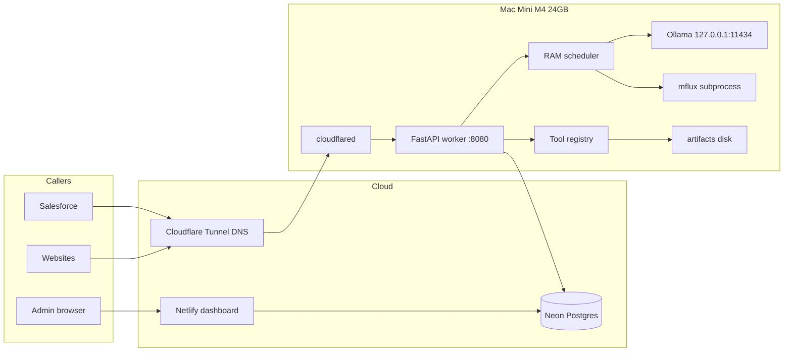

# Cloudiator production plan

**Product name:** Cloudiator (repo `cldM4`)  
**Hardware:** Apple Mac Mini M4, 24GB unified memory  
**Git:** https://github.com/AshrafRezk/cldM4.git  
**Status:** Plan only. Implement on the Mini, one phase at a time.  
**Video:** out of v1.

This file is the source of truth. If Cursor on the Mini disagrees with a blog post, **this file wins**.

**Audit status:** reviewed pre-Phase A. Findings and their fixes are logged in [docs/plan-review-findings.md](docs/plan-review-findings.md); the fixes themselves are patched into this file and `docs/`. Operator inputs that must be filled in before Phase B are in [docs/operator-checklist.md](docs/operator-checklist.md).

Throughout this document, **"Failure if skipped"** marks a rule that has a known, specific way of breaking the appliance. Those are not style preferences.

---

## 0. How to execute this plan (read first)

Clicking **Build** in the original planning chat would have started coding on **that** computer, not “finish the plan.” The plan is this git repo.

On the Mac Mini:

0. **Hardware and internet first:** [docs/hardware-and-network.md](docs/hardware-and-network.md) (right chip/RAM, Ethernet, no WAN port forwards, Cloudflare zone, phone-on-cellular test). Then [docs/host-setup.md](docs/host-setup.md).
1. Install Cursor **Pro Plus**. Clone `https://github.com/AshrafRezk/cldM4.git`.
2. Open **this folder** as the workspace. Apply [docs/cursor-settings.md](docs/cursor-settings.md) (Privacy Mode, Auto **off**, Claude Opus 5 for A/B/D/E, no auto-run terminal).
3. New **Agent** chat. Model = Opus 5. Attach `@PLAN.md`. Paste the prompt for **Phase A only** from [docs/cursor-phases.md](docs/cursor-phases.md).
4. When Phase A definition of done is green, commit, **new chat**, then Phase B, and so on.
5. Never ask one chat to “build the whole product.” Context and RAM on the Mini will thrash.
6. Project rule `.cursor/rules/cloudiator.mdc` must stay Always-on.

Do **not** implement from a laptop and expect Metal/Vision/Ollama to be production-tested. You may write TypeScript dashboard code anywhere; **worker + models + LaunchAgents must be verified on the Mini.**

---

## 1. Product thesis

Cloudiator looks like a private OpenAI:

- Each Salesforce org or website gets an API **link** (base URL + `sk-cld-...` key).
- Each key has a **scope**: which models, which tools, text vs image generation vs OCR vs DuckDB, rate limits, max tokens.
- The public URL returns a **filtered OpenAPI** contract (3.1 for generic clients, a restricted 3.0.3 variant for Salesforce External Services) and **usage**.
- The Mini **orchestrates**: deterministic libraries when possible; local models when language/vision/generation is required.
- 24GB is enough if you treat Metal as **one slot**, not a GPU farm.

This is not ChatGPT quality. It is an always-on, scoped, Salesforce-callable inference + tools appliance.

---

## 2. Locked decisions

| Decision | Choice | Why |
| --- | --- | --- |
| API shape | OpenAI-compatible + Cloudiator extras | Salesforce SDKs, curl, LangChain; plus usage/jobs/OpenAPI |
| Video | Skip v1 | Wan/Hunyuan need more RAM than 24GB for useful quality |
| Cloud “orchestrator” | Netlify = dashboard only | Functions timeout 10–26s; cannot run models |
| Public HTTPS | Cloudflare named Tunnel | No port forward, works behind CGNAT |
| Auth in v1 | **FastAPI worker is the only authenticator.** Cloudflare does TLS, DDoS, WAF skip, and rate limiting — never key validation | Avoid a second proxy timeout hop. A gateway Worker is **not** in v1; do not create `apps/gateway/` |
| Admin auth | Cloudflare Access on `app.<domain>` and `/v1/admin*`. No shared password anywhere | The dashboard mints API keys; a shared password on a public URL is the weakest link in the system |
| LLM runtime | Official Ollama.app + GGUF | Simplest; MLX optional later for 10–20% speed |
| Image generation | mflux FLUX.1-schnell quantized | Apple Silicon native; exclusive RAM slot |
| OCR | Apple Vision (`ocrmac`) | Instant, zero extra weights |
| Maps | Nominatim + Overpass + OSRM | No Google key required |
| Charts/stats/data | matplotlib/plotly, scipy, DuckDB | LLMs lie about numbers |
| Docker for inference | Forbidden | Docker Desktop does not pass Metal well |
| Concurrency | 1 generation at a time, **`uvicorn --workers 1`** | 24GB unified memory; `metal_lock` is in-process and does not survive multiple workers |
| Salesforce long work | Jobs API + poll | Apex max 120s callout |
| Python | 3.11, **arm64 only** | pyobjc/Vision and MLX under Rosetta are broken or pointlessly slow |

---

## 3. Architecture (v1, failure-resistant)



**Why not Netlify as the inference proxy:** cold start + 10s/26s limits. Chat and FLUX will 504.

**Why not Cloudflare Worker as the only gateway in v1:** Worker CPU/time limits and streaming quirks. v1: Tunnel CNAME `api.<domain>` → `cloudflared` → FastAPI. Cloudflare provides TLS, DDoS protection, the WAF skip rule, and rate limiting — **and nothing else**. It never sees or validates an API key. A gateway Worker is a v1.1 idea; `apps/gateway/` must not be scaffolded during v1 phases.

**Failure if skipped — Cloudflare bot protection blocks Salesforce.** Apex callouts are not browsers: no JavaScript, no cookies, no challenge solving. Bot Fight Mode, Browser Integrity Check, Turnstile, or "I'm Under Attack" on `api.<domain>` return an HTML interstitial that Apex cannot parse, and the resulting error looks like a malformed-JSON bug rather than a security block. See §13 for the exact zone settings and the required WAF skip rule.

**Why Neon in the cloud:** dashboard can mint keys while the Mini is rebooting. Inference returns `503` if Mini is down; keys still exist.

**Data flow for a Salesforce chat call:**

1. Apex `POST https://api.<domain>/v1/chat/completions` with `Authorization: Bearer sk-cld-...` and `stream: false`, timeout 120000.
2. Cloudflare edge → tunnel → FastAPI.
3. FastAPI hashes key, loads scopes from Neon (cache 60s in memory).
4. If capability missing → `403` OpenAI-style error.
5. Router: tools vs embeddings vs chat vs jobs.
6. RAM scheduler acquires lock if GPU path.
7. Ollama `/api/chat` with capped `num_ctx` and `num_predict`.
8. Translate to OpenAI JSON. Write `usage_events` to Neon (async, must not block response).
9. Return body. If Mini overloaded → `429` + `Retry-After`.

**Jobs flow (image, 20B, anything that may exceed 90s):**

1. `POST /v1/jobs` → `202` `{ "id", "status": "queued" }`. Honours an optional `Idempotency-Key` header (see §10) so an Apex retry does not start a second FLUX run.
2. Worker SQLite queue on Mini (`~/Cloudiator/queue.db`) so jobs survive FastAPI restart.
3. `GET /v1/jobs/{id}` → `queued|running|succeeded|failed` + `result` or `error`.
4. The caller polls. **Each poll is its own Salesforce transaction** — see §14 and [docs/salesforce.md](docs/salesforce.md) for the three patterns that fit the platform's governor limits. "Poll every 5s for 50 iterations" inside one transaction is not one of them; it exceeds the 120s cumulative callout budget.

---

## 4. Hardware budget (M4 24GB)

macOS Sequoia idle ≈ 5–8 GB. Treat **16 GB** as the model envelope. **18 GB** is the hard ceiling before swap. Swap makes tokens/sec collapse (measured sub-1 tok/s on 32B-class models).

| Resident | RAM | When |
| --- | --- | --- |
| macOS + apps | 5–8 GB | always |
| FastAPI + numpy/pandas/scipy/matplotlib/opencv-headless | 0.7–1.2 GB | always |
| `qwen3.5:9b` hot | 6.6–8 GB | always-hot (**slot 1**) |
| `nomic-embed-text` | 0.3 GB | always-hot (**slot 2, reserved**) |
| KV cache 4k ctx | 0.5–1.5 GB | per loaded LLM |
| `gpt-oss:20b` | ~14 GB | exclusive; unload 9B first |
| FLUX schnell **4-bit** | 9–12 GB peak | exclusive; default |
| FLUX schnell 8-bit | 13–16 GB peak | exclusive; **opt-in, measure first** |
| Whisper large-v3-turbo | ~1.6 GB | exclusive |
| Headless Chromium (mmdc / kaleido) | 0.4–1.2 GB per render | CPU, but see `cpu_heavy_lock` in §8 |
| DuckDB query | tens–hundreds MB | CPU, skip `metal_lock` |

**Never coresident:** 9B+20B, 9B+FLUX, 20B+FLUX, 27B+anything, FLUX+Chromium.

The numbers above are estimates from this SKU class, not measurements of *your* machine. Record real values in `docs/operator-checklist.md` §9 during Phases A and E. **If `sysctl vm.swapusage` shows non-zero swap at any peak, reduce the configuration — do not proceed.**

### The two-slot rule

`OLLAMA_MAX_LOADED_MODELS=1` and "9B and the embedder are both always hot" cannot both be true. With a limit of 1, every embeddings call evicts the 9B and the next chat pays a 5–15s cold load; chat latency becomes randomly terrible and nobody can reproduce it.

So: **`OLLAMA_MAX_LOADED_MODELS=2`**, with a product rule that Ollama itself cannot express —

- **Slot 1** holds exactly one *generative* model (the 9B, or an exclusive model while it runs).
- **Slot 2** is reserved for `nomic-embed-text` and nothing else (0.3 GB, no Metal contention worth worrying about).

The "one Metal-heavy model" invariant is enforced by the worker's `metal_lock` plus an explicit unload-and-verify before every exclusive load (§8), **not** by the Ollama limit. Belt and braces:

- On startup, assert `OLLAMA_MAX_LOADED_MODELS == 2`; refuse to boot otherwise.
- Before any exclusive load, poll `/api/ps` until nothing but `nomic-embed-text` remains.
- If `/api/ps` ever reports two generative models, that is a P0 bug: log loudly, set `/v1/health` to `degraded`, and stop accepting exclusive work.

**Failure if skipped:** raising the limit to 4 "to fix embeddings" puts 9B + 20B resident at ~21 GB, the box swaps, and throughput drops below 1 tok/s.

**Ollama env (LaunchAgent):**

```bash
OLLAMA_HOST=127.0.0.1:11434
OLLAMA_MAX_LOADED_MODELS=2     # slot 1 = one generative model, slot 2 = nomic-embed-text only
OLLAMA_NUM_PARALLEL=1
OLLAMA_MAX_QUEUE=32
OLLAMA_FLASH_ATTENTION=1
OLLAMA_KEEP_ALIVE=30m          # safety net only — see keep-alive precedence below
OLLAMA_ORIGINS=http://127.0.0.1:8080
```

### Keep-alive precedence (resolves the `-1` vs `30m` contradiction)

`OLLAMA_KEEP_ALIVE` is only the default for requests that **omit** `keep_alive`. The worker must never omit it.

| Path | `keep_alive` sent by the worker |
| --- | --- |
| Hot chat model (9B) | `-1` (resident forever) |
| `nomic-embed-text` | `-1` |
| Any exclusive model (20B, whisper) | `0` — unload the moment the call returns |
| Anything else | `0` |

`OLLAMA_KEEP_ALIVE=30m` stays as the env default purely as a **safety net**: if the worker crashes while an exclusive model is resident, the Mini reclaims 14 GB half an hour later instead of never. In normal operation the env value is never the effective value.

**Failure if skipped:** omit `keep_alive` on the hot model and it unloads after 30 quiet minutes; the next Salesforce call spends 5–15s of its 120s budget on a cold load, and the first call every morning is the slow one.

`OLLAMA_ORIGINS` is a **browser CORS** setting. It is not authentication and it does not protect port 11434. The only protection on 11434 is the loopback bind — any local process or logged-in user can drive it directly (§12).

Context caps: default `num_ctx=4096`, max `8192` on 9B. Salesforce keys: `max_tokens=512` (about 25–40s at 15–22 tok/s, inside 120s). Ollama **silently drops the oldest tokens** when a prompt exceeds `num_ctx`; the worker must detect this before the call and return `400 context_length_exceeded` instead (§10).

### Memory pressure polling

Poll every 5s, off the request path, and cache the result:

```bash
sysctl -n kern.memorystatus_vm_pressure_level   # 1 = normal, 2 = warn, 4 = critical
sysctl -n vm.swapusage                          # must stay at 0 used
vm_stat                                         # free/inactive pages if you want a free_mb number
```

Use `asyncio.create_subprocess_exec`, never a blocking `subprocess.run` in the event loop. `sysctl` is cheap; spawning the `memory_pressure` binary every 5s is not, and its output format is awkward to parse — prefer the `sysctl` integer and keep `memory_pressure` for humans debugging at a terminal.

On `warn` or `critical`: refuse new exclusive jobs with `429` + `Retry-After`, refuse new Chromium-backed renders, `ollama stop` anything cold, keep the 9B resident if at all possible. On recovery to `normal` for two consecutive polls, resume.

### Disk

Budget **120 GB free** for the full v1 set. The 256 GB SSD variant is genuinely tight and may not fit FLUX 8-bit plus `gpt-oss:20b`; check `df -h /` before Phase E rather than discovering it mid-download.

| Consumer | Size |
| --- | --- |
| `~/.ollama` — 9B + embed | ~7 GB |
| `~/.ollama` — `gpt-oss:20b` (Phase E, opt-in) | ~14 GB |
| `~/.cache/huggingface` — FLUX **full precision**, if you let mflux download it | **~34 GB** (see §7; avoid or reclaim) |
| `~/Cloudiator/models` — FLUX pre-quantized 4-bit | ~7 GB |
| Whisper large-v3-turbo | ~1.6 GB |
| `~/Cloudiator/artifacts` | grows without a TTL |
| `~/Cloudiator/logs` | grows without rotation |

Artifacts and logs are the two that fill a disk unattended:

- `ARTIFACT_TTL_HOURS` default **24**; a janitor sweeps `~/Cloudiator/artifacts` every 15 minutes.
- `MIN_FREE_DISK_GB` default **10**: below this, refuse new generation jobs (`429`) and report `/v1/health` as `degraded`. Below **5 GB**, refuse everything that writes.
- Worker logs rotate via `newsyslog.d` (see [docs/host-setup.md](docs/host-setup.md)). `KeepAlive=true` plus an unrotated `StandardOutPath` is an unbounded file.

**Failure if skipped:** a full SSD takes down Ollama, the worker, and cloudflared simultaneously, and the Mini will not come back cleanly.

Exclude the weight caches from Time Machine and Spotlight (`~/.ollama`, `~/.cache/huggingface`, `~/Cloudiator/artifacts`, `~/Cloudiator/logs`) — commands in `docs/host-setup.md`. **Failure if skipped:** Time Machine copies tens of GB of weights on a schedule and `mdworker` indexes GGUFs, both producing disk and memory churn in the middle of a generation.

### Power and unattended boot

System Settings → Energy: prevent sleep when the display is off, wake for network access, start up automatically after a power failure. Display may sleep; **the computer must not**.

**FileVault and unattended reboot are in conflict, and you must choose.** With FileVault on, a cold boot stops at the pre-boot unlock screen. There is no user session, so no LaunchAgent runs and Ollama.app — a GUI application — does not start. "Start up automatically after a power failure" gets you to a locked screen and no further. `sudo fdesetup authrestart` unlocks the disk for exactly one planned reboot; it does nothing for a power cut.

Pick one in `docs/operator-checklist.md` §6: FileVault + UPS + manual unlock (recommended), FileVault with `authrestart` for planned reboots, or FileVault off with a documented compensating control. Whichever you pick, enable automatic login for the appliance account — without a GUI session the LaunchAgents in §6 never run.

Thermal: M4 Mini active cooling holds 9B indefinitely. FLUX bursts are fine. Do not put the Mini in a closed cabinet.

---

## 5. Accounts and prerequisites (create before Phase B)

Needed:

- GitHub access to `AshrafRezk/cldM4`
- [Neon](https://neon.tech) free/launch Postgres (region close to you; dashboard uses it)
- [Cloudflare](https://dash.cloudflare.com) account + a domain (or a Cloudflare-managed subdomain)
- [Netlify](https://netlify.com) account for the admin UI
- Hugging Face account (optional; FLUX schnell is Apache 2.0)
- Optional: Google Maps/Places API key
- Optional: Slack incoming webhook for Mini down alerts

Fill in [docs/operator-checklist.md](docs/operator-checklist.md) before Phase B. Sections 1–5 of that file must have no blanks, and section 6 must have exactly one boot policy ticked.

Local on Mini:

- macOS 14 Sonoma or newer (15 Sequoia preferred)
- Xcode Command Line Tools: `xcode-select --install`
- Homebrew
- Python **3.11**, **arm64** (`brew install python@3.11`) — pin 3.11 for Vision/MLX wheels
- `uv` (`brew install uv` or `curl -LsSf https://astral.sh/uv/install.sh | sh`)
- Node **22 LTS** (`brew install node@22`)
- Official **Ollama.dmg**: https://ollama.com/download/mac — not Homebrew-only (brew has had `llama-server` path bugs). If `brew list ollama` returns anything, uninstall it first: two servers fight over 11434 and the brew one starts **without** the LaunchAgent env
- `cloudflared`: `brew install cloudflared`
- `ffmpeg graphviz zbar poppler`: see host-setup

### Architecture gate (run before anything else)

```bash
uname -m                                             # must print: arm64
which -a python3.11
python3.11 -c "import platform; print(platform.machine())"   # must print: arm64
file "$(which python3.11)"                           # must say arm64, not x86_64
```

**Abort the phase if any of these say `x86_64`.** A Terminal, Homebrew, or Python installed under Rosetta gives you a translated interpreter where `pyobjc-framework-Vision` fails to import and `mlx` either refuses to install or runs on the CPU. Apple Vision OCR and every MLX path are the reason this hardware was chosen; losing them silently turns the whole appliance into a slow Linux box.

If `pyobjc` Vision imports but fails at runtime complaining about a framework build, recreate the venv against Homebrew's framework Python: `uv venv --python /opt/homebrew/opt/python@3.11/bin/python3.11`.

---

## 6. Target repo layout (create during phases)

```
cldM4/
  README.md
  PLAN.md
  docs/
  apps/
    dashboard/          # Vite + React, Netlify
    worker/             # FastAPI, runs only on Mini
      tools/<family>/
  packages/schema/      # OpenAPI fragments, scope enums
  infra/neon.sql        # copy of docs/schema.md
  scripts/
    mac-setup.sh
    install-launchagents.sh
  .python-version       # 3.11, committed
  uv.lock               # committed from Phase A onward
  .env.example
```

`apps/gateway/` is **not** part of v1. Do not scaffold a Cloudflare Worker during any v1 phase — see §2.

Worker binds `127.0.0.1:8080` only, **single process**:

```bash
uvicorn app.main:app --host 127.0.0.1 --port 8080 --workers 1
```

- `--workers 1` is mandatory and explicit. No `--reload` in the LaunchAgent. No gunicorn, no `WEB_CONCURRENCY`.
- Assert it at startup: if `WEB_CONCURRENCY` is set to anything but `1`, or the process detects siblings, refuse to boot with a clear message.

**Failure if skipped:** `metal_lock` is an in-process `asyncio.Lock`. Two workers means two independent locks and two schedulers, each convinced it owns Metal. The first concurrent FLUX + 20B pair puts ~25 GB of demand on a 24 GB machine.

cloudflared is the only public path.

---

## 7. Models to download (v1)

Install Ollama from https://ollama.com/download/mac. **Pulls are phase-scoped.** Pulling everything up front costs ~35 GB of disk and an hour of home bandwidth during the phase where you are trying to prove a 30-line HTTP shim works.

| Pull in | Model | Size | Why then |
| --- | --- | --- | --- |
| **Phase A** | `qwen3.5:9b` | ~6.6 GB | the default brain; nothing works without it |
| **Phase A** | `nomic-embed-text` | ~274 MB | slot 2, `/v1/embeddings` |
| Phase A (optional) | `llama3.2:3b` | ~2 GB | fallback if the 9B tag does not resolve or misbehaves |
| **Phase E**, opt-in | `gpt-oss:20b` | ~14 GB | exclusive slot only; useless until the jobs queue exists |
| **Never** | `gpt-oss:120b`, any 70B, `qwen3.5:27b` as a default | — | exceeds the 18 GB ceiling; guaranteed swap |

`qwen3.5:27b` may be pulled later as an **idle-only, manually triggered** experiment on a machine with disk to spare. It must never be a key's default model and must never be hot.

`HEAVY_MODEL` stays commented out in `.env` until the Phase E pull actually completes. `GET /v1/models` must be built from live `ollama tags` intersected with the key's scope — never from env alone. **Failure if skipped:** the API advertises `gpt-oss:20b`, a caller selects it, and Ollama starts a 14 GB download inside an HTTP request.

### Phase A step 0 — model tag verification gate

`qwen3.5:9b` is the *intended* tag. Model libraries move. Verify before you build anything on top of it:

```bash
ollama pull qwen3.5:9b && ollama show qwen3.5:9b
```

Read the `show` output and confirm two things: the model supports **tools** (the tool registry in §9 depends on it) and whether it supports **vision**.

If the tag does not resolve, walk this ladder and take the first that resolves, supports tools, and fits 6–9 GB:

1. the current `qwen3.5` tag in the 7–9B range on https://ollama.com/library/qwen3.5
2. `qwen3:8b`
3. `qwen2.5:7b-instruct`
4. `llama3.1:8b`

Then: record the choice in `docs/operator-checklist.md` §8, set `DEFAULT_MODEL` in `.env`, and change **nothing else** — every other file refers to the model through `DEFAULT_MODEL`. Do not substitute a 27B or a 14B "since we're changing it anyway".

**On vision:** if the chosen model has no vision capability, the image path in §9 and §10 is **OCR-only** and `/v1/chat/completions` with an `image_url` returns `model_not_found`. That is an acceptable v1. If you genuinely need VLM chat, a small VLM (e.g. a 7B-class vision model, ~6 GB) occupies **slot 1** — it swaps with the 9B and pays the full cold-load cost on every alternation. It is not a third hot model. Decide once, write it in the checklist, and do not let a later phase quietly add it.

Library pages:

- https://ollama.com/library/qwen3.5
- https://ollama.com/library/gpt-oss
- https://ollama.com/library/nomic-embed-text
- https://ollama.com/library/llama3.2

Image (Phase E):

```bash
uv tool install --upgrade mflux
```

**Do not run `mflux-generate --model schnell --quantize 8` as a smoke test on a clean machine.** That command downloads the full-precision FLUX.1-schnell repo — transformer, T5 text encoder, CLIP, VAE, roughly **34 GB** — and then quantizes it in memory, every cold start. On a 256 GB Mini that is most of your headroom, and the first `/v1/images/generations` request that triggers it will blow every HTTP timeout between Apex and the worker.

Phase E step 0, run **interactively in Terminal**, never from the worker:

1. Check disk: `df -h /`. Need ≥ 40 GB free if you take the full-download path, ≥ 15 GB for the pre-quantized path.
2. Prefer a **pre-quantized** MLX repo so the big download never happens: https://huggingface.co/argmaxinc/mlx-FLUX.1-schnell-4bit-quantized (~7 GB).
3. If your mflux version only supports quantizing locally, do it **once** and save the result, then reclaim the full weights:
   ```bash
   mflux-save --model schnell --quantize 4 --path ~/Cloudiator/models/flux-schnell-4bit
   du -sh ~/.cache/huggingface        # ~34 GB of full-precision weights you no longer need
   # remove the FLUX.1-schnell entry from the HF cache once the saved model generates correctly
   ```
4. Point `MFLUX_MODEL_PATH` at the saved local model and always pass it. A worker run must never resolve weights from the network.
5. Generate once by hand and time it:
   ```bash
   time mflux-generate --path ~/Cloudiator/models/flux-schnell-4bit --steps 4 \
     --height 1024 --width 1024 --prompt "a red bicycle" --output /tmp/test.png
   ```
6. Watch Activity Monitor during that run and record the peak in `docs/operator-checklist.md` §9.

**4-bit is the default on a 24 GB box.** 8-bit peaks meaningfully higher than the old "6–10 GB" estimate once the T5 encoder is resident, and the margin against the 18 GB ceiling disappears. 8-bit is opt-in and only after you have measured it with `sysctl vm.swapusage` still at zero.

- Code: https://github.com/filipstrand/mflux (also https://github.com/godspeed5/mflux)
- Weights: https://huggingface.co/black-forest-labs/FLUX.1-schnell (Apache 2.0)
- Quantized: https://huggingface.co/argmaxinc/mlx-FLUX.1-schnell-4bit-quantized
- Target: 1024×1024, 4 steps, ~10–20s on M4 24GB once weights are local and pre-quantized

Speech (Phase F optional):

```bash
pip install mlx-whisper   # in worker venv
```

https://huggingface.co/mlx-community/whisper-large-v3-turbo (~1.6 GB)

Benchmarks for this SKU:

- https://modelfit.io/blog/best-llm-mac-mini-m4-24gb/
- https://github.com/scott-crenshaw/local-llm-feasibility-study
- https://ai-desk.tech/blog/mac-mini-m4-pro-vs-m4-stable-diffusion
- https://medium.com/@trends24/i-tried-130-llms-on-my-m4-mac-mini-these-9-are-actually-insane-03e6226540c3

---

## 8. RAM scheduler (implement exactly)

Single `asyncio.Lock` named `metal_lock` plus a state machine:

```
states: idle_hot_9b | loading | chat_9b | exclusive_20b | exclusive_flux | exclusive_whisper | pressure_shed
```

Rules:

0. **Single process.** `uvicorn --workers 1` (§6). The scheduler is in-process state; a second worker means a second scheduler and the whole section is void. Assert at startup.
1. Tools and DuckDB **do not** take `metal_lock`.
2. Embeddings allowed during `idle_hot_9b` and `chat_9b` (slot 2, §4).
3. Chat 9B: acquire lock, `OLLAMA_NUM_PARALLEL=1`, send `keep_alive: -1`.
4. Exclusive: stop the hot model (`keep_alive=0` or `ollama stop`), **poll `/api/ps` until nothing but `nomic-embed-text` remains**, then load the target, run it, unload it, reload the hot model with `keep_alive=-1`. Never assume the stop took effect — poll.
5. If lock wait > 2s for sync Salesforce chat → `429` with `Retry-After: 5`. Offer `POST /v1/jobs` in error `param`.
6. If memory pressure is not `normal` → no new exclusive work, no new Chromium-backed renders; optionally no new chat.
7. **Second lock: `cpu_heavy_lock`** (capacity 1, separate from `metal_lock`). Held by Chromium-backed renderers (`mmdc`, `kaleido`), DuckDB scans over large inputs, and multi-megapixel OpenCV work. "Tools do not take `metal_lock`" is correct about Metal and wrong about RAM: a headless Chromium is 0.4–1.2 GB and it does not care that FLUX is mid-generation. Acquiring `cpu_heavy_lock` additionally requires memory pressure `normal` and no exclusive slot held.

Keep-alive precedence is in §4 and is not optional: the worker always sends an explicit `keep_alive`.

### Exclusive slot contract (write it exactly this way)

The happy path is easy. The crash path is what keeps the appliance alive. If mflux is OOM-killed, raises, or hangs, and the reload is not in a `finally`, the lock is held forever and the hot model is gone — every subsequent call gets a `429` until a human reboots the Mini. This is the single most likely way this box dies unattended at 3am.

```python
async def run_exclusive(kind: str, run):
    async with metal_lock:                      # released even on cancellation
        try:
            await unload_hot_model()            # keep_alive=0
            await wait_until_only_embed_loaded(timeout=30)
            state.set(f"exclusive_{kind}")
            return await asyncio.wait_for(run(), timeout=EXCLUSIVE_TIMEOUT)
        finally:
            await kill_orphan_subprocesses()    # terminate(), then kill() after grace
            await unload_all_generative()       # keep_alive=0, best effort
            await reload_hot_model()            # keep_alive=-1, best effort, logged on failure
            state.set("idle_hot_9b")
```

Non-negotiable properties:

- `async with metal_lock` — never a manual `acquire()`/`release()` pair. A raised exception between them leaks the lock.
- Subprocesses (mflux, whisper) get a hard wall-clock timeout, then `terminate()`, then `kill()` after a short grace period. A hung mflux holding 12 GB is worse than a failed job.
- The hot-model reload is in `finally` and is **best effort**: if it fails, log it, mark health `degraded`, and let the watchdog retry — do not raise out of `finally` and mask the original error.
- **Watchdog:** a background task checks every 30s. If `/api/ps` shows no generative model and no exclusive job is running for 60 consecutive seconds, re-warm the hot model. This is what recovers the box after an OOM kill.
- Test this deliberately in Phase E: `kill -9` the mflux process mid-generation and confirm that chat works again within 60s with no human intervention.

---

## 9. Tool registry

Worker is a **tool host**. Every tool:

- `apps/worker/tools/<id>/handler.py`
- `schema.json` OpenAI function
- REST `POST /v1/tools/...`
- Scope flag on the key
- `gpu: false` except FLUX/whisper/rembg
- Caps on time, bytes, rows
- Artifacts under `~/Cloudiator/artifacts/{uuid}.{ext}`
- Tests with a golden fixture

**Router:**

1. `/v1/tools/*` → library, no model.
2. Image + “read/barcode/invoice text” → OCR or pyzbar, not VLM unless layout reasoning needed after.
3. CSV/JSON + chart/aggregate language → DuckDB / stats / chart, LLM only narrates.
4. “Generate a picture of…” → FLUX if scoped else 400.
5. Resize/blur/compare → Pillow/OpenCV, never FLUX.
6. Unstructured language → 9B with ≤12 tools.

**Default chat tools (max 12):** `ocr_image`, `geocode`, `places_nearby`, `render_chart`, `stats_describe`, `sql_on_table`, `extract_document`, `image_transform`, `fuzzy_match`, `convert_units`.

### Tool loop contract (FastAPI owns it)

**FastAPI executes the tool loop. Ollama never does.** Do not delegate tool execution to the runtime, and do not use any client-side helper that auto-runs tools. The worker parses `tool_calls` out of the model response, executes them itself, appends `role: "tool"` messages, and calls the model again.

Why it has to be this way: the worker is the only place that knows the key's scopes, the per-tool timeouts, the artifact store, and the usage accounting. Hand the loop to the runtime and all four are lost.

Hard limits, all enforced by the worker:

| Limit | Value | On breach |
| --- | --- | --- |
| Tool-call iterations per request | **8** | stop looping, return the best answer so far |
| Sync tool-loop wall clock | **75s** shared budget, checked *before* each iteration | stop looping, return what you have |
| Per-tool timeout | that tool's own cap (§10) | that tool call returns an error result into the conversation; the loop continues |
| Parallel tool calls in one turn | executed concurrently, but `cpu_heavy_lock` still serialises the heavy ones | — |

- Re-check the key's scope on **every** tool call, not once at request start. A model that invents `flux_generate` on turn 6 must get a `scope_denied` tool result, not an image.
- When the iteration cap or the time budget stops the loop, return a normal completion with `finish_reason: "stop"` and set `x-cloudiator-tool-iterations` on the response so the caller can tell. Never return a half-serialised `tool_calls` array to an OpenAI client.
- If the model produces zero progress (identical tool call with identical arguments twice in a row), break immediately — that is the loop that burns the whole 75s budget.

**Failure if skipped:** an unbounded loop runs until Cloudflare's ~100s origin timeout and Apex receives a 524 HTML page instead of an OpenAI error object.

**Worker toolbelt RAM ~0.7–1.2 GB.** OK beside 9B. Unload 20B before huge DuckDB/OpenCV.

**Hard bans:** unrestricted `eval`; Playwright in v1; TensorFlow/PyTorch in the worker process (mflux/whisper = subprocess); face **recognition**; video gen; captcha solvers.

Install (also in [docs/host-setup.md](docs/host-setup.md)):

```bash
brew install ffmpeg graphviz zbar poppler
uv pip install \
  fastapi uvicorn pydantic httpx python-multipart aiofiles \
  numpy pandas polars duckdb pyarrow \
  scipy statsmodels pingouin sympy numpy-financial scikit-learn \
  matplotlib seaborn plotly kaleido altair vl-convert-python great-tables pygal \
  pillow pillow-heif opencv-python-headless scikit-image ImageHash piexif colorthief qrcode python-barcode pyzbar \
  pypdf pdfplumber pdf2image python-docx openpyxl python-pptx reportlab fpdf2 markdown bleach jinja2 trafilatura lxml beautifulsoup4 \
  rapidfuzz phonenumbers python-dateutil holidays workalendar pint jsonschema jmespath charset-normalizer ftfy tiktoken icalendar \
  shapely pyproj networkx pydub ocrmac pyobjc-framework-Vision
npm i -g @mermaid-js/mermaid-cli
export MPLBACKEND=Agg
```

Use `opencv-python-headless` only.

### Family 0 — OCR and maps

- OCR: `ocrmac` / `pyobjc-framework-Vision`. CLI: https://github.com/MatthiasWinkelmann/macocr . Pattern: https://github.com/timaliev/mcp_ocr
- Nominatim: https://nominatim.openstreetmap.org — **must** send `User-Agent: Cloudiator/0.1 (contact@yourdomain)` with a real, monitored mailbox, and obey 1 req/s. Policy: https://operations.osmfoundation.org/policies/nominatim/
  - **Cache before you rate-limit.** A persistent geocode cache (SQLite at `GEOCODE_CACHE_DB`, 30-day TTL, normalised query as the key) is required, and the 1 rps limiter applies to **cache misses only**. Without it, a chat tool loop geocoding a 50-row list takes 50 seconds of a 75s budget and still burns 50 requests against the public instance.
  - Honour `Retry-After`. Never parallelise Nominatim calls — the limiter is a single process-wide gate, not per-request.
  - Refuse bulk geocoding above a documented row count (start at 25 per request) with an error that points at self-hosting. Bulk use of the public instance is against the policy and gets your **home IP** blocked, which takes out everything else on that connection.
- Overpass: https://overpass-api.de/api/interpreter + mirrors
- OSRM: https://router.project-osrm.org
- MCP schemas to copy: https://github.com/cyanheads/openstreetmap-mcp-server https://github.com/GRABOSM/osm-mcp
- Google Places only if env key **and** scope `tools.google_places`

Production volume: self-host Nominatim or a paid geocoder. Public Nominatim will ban you.

### Family A — Charts (`tools.charts`)

matplotlib+seaborn PNG; plotly+kaleido; altair+vl-convert; pygal SVG; great-tables.  
`POST /v1/tools/chart` → artifact URL. LLMs must not invent series values.

### Family B — Image ops (`tools.image_ops`) not generation

Pillow, pillow-heif, OpenCV headless, scikit-image, ImageHash, piexif (default strip GPS), colorthief, qrcode, python-barcode, pyzbar.  
Face detect opt-in `tools.face_detect` only. rembg = v1.1 exclusive.

### Family C — Stats (`tools.stats`)

numpy, scipy.stats, statsmodels, pingouin, small sklearn (<200k rows), sympy, numpy-financial.  
Actions: describe, corr, ttest_ind, chi2, ols, logit, monte_carlo, npv, irr, solve_expr.  
LLM may word p-values, never recompute.

### Family D — DuckDB (`tools.data`)

Read-only SQL over caller-supplied tabular data. Timeout 30s, 10k row preview, parquet artifact if larger. Highest Salesforce leverage after chat.

**Configuration lockdown first; keyword filtering is only defence in depth.** A regex allowlist loses to `read_csv_auto('/etc/passwd')`, `ATTACH`, `PRAGMA`, and comment tricks. Build the connection so the dangerous operations do not exist:

```sql
-- fresh in-memory connection per request, then:
SET enable_external_access = false;   -- kills http/s3 reads and remote attach
SET disabled_filesystems = 'LocalFileSystem';
SET lock_configuration = true;        -- nothing after this point can re-enable the above
```

Then: register the caller's data as an in-memory relation and let them query **only** that. Never interpolate a caller string into a path.

On top of that, a keyword prefilter allowing `SELECT`, `WITH`, `DESCRIBE`, `SUMMARIZE` as the leading statement, single-statement only (reject anything containing `;` after trimming), and rejecting `COPY`, `INSTALL`, `LOAD`, `ATTACH`, `PRAGMA`, `SET`, `EXPORT`, `CREATE`, `INSERT`, `UPDATE`, `DELETE`, `DROP`.

These must all be rejected, and each belongs in the test fixture:

```sql
COPY (SELECT 1) TO '/tmp/x.csv';
SELECT * FROM read_csv_auto('/etc/passwd');
SELECT * FROM read_parquet('s3://bucket/key');
ATTACH '/Users/me/Cloudiator/queue.db' AS q;
INSTALL httpfs; LOAD httpfs;
PRAGMA database_list;
SELECT 1; DROP TABLE t;
SELECT /* comment */ * FROM read_csv_auto('/etc/hosts');
```

**Failure if skipped:** `tools.data` is a scoped feature handed to third-party Salesforce orgs. A filesystem read here returns `~/Cloudiator/.env` — including `DATABASE_URL` and the artifact signing secret — to a tenant.

### Family E — Docs (`tools.docs`)

Extract: pypdf, pdfplumber, pdf2image+OCR, python-docx, openpyxl, python-pptx, trafilatura.  
Render: Jinja2, fpdf2, openpyxl write, python-pptx. LLM writes outline; library writes PPTX.

### Family F — Text (`tools.text`)

tiktoken, rapidfuzz, phonenumbers, charset-normalizer, ftfy, jmespath, jsonschema, Salesforce 15↔18 IDs (see salesforce.md).

### Family G — Time/units (`tools.time`, `tools.units`, `tools.fx`)

dateutil, zoneinfo, holidays, workalendar, icalendar, pint. FX: Frankfurter https://www.frankfurter.app/docs/ only, never hallucinate rates.

### Family H — Diagrams (`tools.diagrams`)

**Graphviz is the default renderer.** It is a small native binary, renders in milliseconds, and costs tens of megabytes. LLM writes DOT; `dot` renders.

`mermaid-cli` (`mmdc`) is **opt-in, off by default** (`ENABLE_MERMAID=false`). It ships a full headless Chromium: ~150–200 MB on disk and **0.4–1.2 GB resident per render**. That is a meaningful fraction of a 24 GB box and it does not care that FLUX is mid-generation.

If you enable it:

- It takes `cpu_heavy_lock` (§8 rule 7) and is refused when memory pressure is not `normal` or an exclusive slot is held.
- Launch flags `--no-sandbox --single-process --disable-dev-shm-usage`, a 30s timeout, and kill the process tree on timeout — orphaned Chromium processes accumulate.
- On any failure, fall back to Graphviz rather than failing the request.

The same applies to `kaleido` for plotly PNGs (Family A): Chromium-backed, `cpu_heavy_lock`, and **matplotlib is the fallback**. Never let a missing or crashed kaleido fail worker import or a chart request.

### Family I — Geo extras

shapely, pyproj, geodesic distance.

### Family J — Audio ops vs Whisper

pydub/ffmpeg = `tools.audio_ops` (no GPU). Whisper = exclusive GPU.

### v1.1 later

sqlite-vec RAG, rembg, weasyprint, PaddleOCR-VL for CJK.

### Key presets

- **Salesforce engineer (default):** chat, embeddings, ocr, maps, charts, stats, data, docs, text, time, image_ops. Model 9B only. `max_tokens=512`. No FLUX, no 20B, no Google, no face.
- **Creative:** + image_generation + diagrams
- **Analyst:** charts/stats/data heavy
- **Heavy:** + gpt-oss:20b exclusive
- **Speech:** + transcriptions + audio_ops

---

## 10. HTTP API

Base: `https://api.<domain>/v1`  
Optional vanity: `https://api.<domain>/t/{tenant_slug}/v1` (same auth).

OpenAI-compatible:

- `POST /v1/chat/completions`
- `POST /v1/embeddings`
- `POST /v1/images/generations`
- `GET /v1/models`
- `POST /v1/audio/transcriptions`

Cloudiator:

- `GET /v1/openapi.json` — **generated from that key’s scopes**. `?target=salesforce` emits the restricted 3.0.3 variant (see below)
- `GET /v1/usage` `GET /v1/usage/events`
- `POST /v1/jobs` `GET /v1/jobs/{id}`
- `POST /v1/artifacts/{id}/sign` — re-mint a signed URL for an artifact that has not yet expired from disk
- Tools routes listed in families
- `GET /v1/health` — `{ "ok", "free_mb", "loaded", "queue_depth", "outbox_depth", "pressure", "free_disk_gb", "db", "version" }` (no secrets)
- `POST /v1/admin/...` — Cloudflare Access only, never public

Auth: `Authorization: Bearer sk-cld-<public_id>_<secret>`  
Store in Neon: `key_id`, `public_id`, `secret_hash` (argon2id), scopes JSON, budgets.  
Show plaintext secret **once** in the dashboard.

Error body (OpenAI-shaped):

```json
{ "error": { "message": "...", "type": "invalid_request_error", "param": null, "code": "context_length_exceeded" } }
```

Codes to implement: `invalid_api_key` 401, `insufficient_quota` 429, `scope_denied` 403, `model_not_found` 404, `mini_offline` 503, `metal_busy` 429, `job_not_found` 404, `upload_too_large` 413, `sql_not_allowed` 400, `context_length_exceeded` 400, `not_supported` 400/404, `url_not_allowed` 400, `response_too_large` 413, `disk_full` 429.

### Timeout ladder (one ordered budget, not five independent numbers)

Each layer must fail **before** the layer above it, so the caller always gets a Cloudiator error object instead of somebody else's HTML:

| Layer | Budget | Owner |
| --- | --- | --- |
| Individual tool call | its own cap (most 30s, DuckDB 30s, mmdc 30s) | worker |
| Tool loop, total | **75s** shared, checked before each iteration | worker |
| Worker hard deadline for any sync request | **90s** — return an OpenAI-shaped timeout error | worker |
| Cloudflare proxy read timeout | **~100s**, returns a 524 **HTML page**, not configurable on the plans in use | Cloudflare |
| Apex `req.setTimeout` | **120000 ms** — headroom only, never the real limit | Salesforce |

The 100s Cloudflare timeout is the true ceiling, not the 120s Apex number. **Failure if skipped:** anything that runs past ~100s hands Apex a 524 HTML body, `JSON.deserialize` throws, and the Salesforce-side error says nothing about timeouts.

Other paths: embeddings 15s. Images are **always** a job for Salesforce keys; an optional 25s sync path exists for browser keys only.

### Parameter support matrix (so OpenAI SDKs fail loudly, not weirdly)

**Reject with `400 not_supported`** — silently ignoring these produces wrong results the caller cannot see:

`n` > 1, `logprobs`, `top_logprobs`, `best_of`, `logit_bias`, `stream: true` on a key with `force_no_stream` (see §14 for the Salesforce downgrade behaviour), `tool_choice: "required"` if unsupported by the chosen model.

**Accept and pass through:** `temperature`, `top_p`, `seed`, `stop`, `max_tokens`, `presence_penalty`, `frequency_penalty`, `tools`, `tool_choice: auto|none`, `response_format: {"type":"json_object"}`.

**404 `not_supported`** on endpoint families that will never exist in v1, with an OpenAI-shaped body so SDKs surface a readable error: `/v1/assistants*`, `/v1/threads*`, `/v1/fine_tuning*`, `/v1/files*`, `/v1/images/edits`, `/v1/images/variations`, `/v1/moderations`, `/v1/batches`.

`GET /v1/models` returns the intersection of **live `ollama tags`** and the key's `models` scope. Never list a model that is not on disk.

An optional, scoped alias map (`gpt-4o` → `DEFAULT_MODEL`) makes drop-in SDK demos work. Off by default; when a key has it enabled, the response `model` field reports the **real** model, not the alias.

### Context enforcement

Ollama **silently drops the oldest tokens** when the prompt exceeds `num_ctx`. The caller gets a confident answer to half a question. Before every chat call, estimate prompt tokens (tiktoken is close enough); if `prompt_tokens + max_tokens > key.max_context`, return `400 context_length_exceeded` with both numbers in the message. Do not let the runtime truncate.

### Vision input rules

Applies to `messages[].content[].image_url` and to any tool that takes an image URL.

- Accept `data:` URIs and `https://` only. Reject `http://`, `file://`, `ftp://`, and anything else with `400 url_not_allowed`.
- **Resolve DNS first and check every resolved address** against loopback, RFC1918, link-local including `169.254.0.0/16`, CGNAT `100.64.0.0/10`, IPv6 ULA and loopback, and multicast. Re-check after **every** redirect; cap redirects at 2.
- Content-Type must be an image; 25 MB and 10s caps per fetch.
- Downscale before the model: long edge ≤ **1024 px**, JPEG q85, EXIF stripped. Max **4 images** per request.

**Failure if skipped (SSRF, P0):** the API is OpenAI-compatible, so the image URL is attacker-controlled by design. Without this, a tenant points it at `http://169.254.169.254/` or `http://127.0.0.1:11434/` and reads the response back out through the model. **Failure if skipped (downscale):** a 12 MP phone photo becomes thousands of image tokens, silently overflows a 4k context, and drops the actual question.

### Jobs, idempotency, and correlation

- `POST /v1/jobs` accepts an optional `Idempotency-Key` header, unique per `key_id` for 24h. A repeat returns the **original** job with `200` instead of creating a second one. **Failure if skipped:** Apex retries a timed-out callout, and the Mini serialises two identical FLUX runs while the caller waits twice as long.
- Every response — success or error, including 4xx and 5xx — carries `X-Request-Id`. Accept an inbound one, generate a UUID otherwise, write it to `usage_events.request_id`, and log it. It is the only key that joins the Cloudflare log, the worker log, and the usage row.

### Uploads and response size

Uploads: 25 MB image, 50 MB CSV, 20 MB PDF.

Response size is capped for keys with `force_no_stream` (`max_response_bytes`, default **1 MB**): Apex's heap is ~6 MB synchronous and a large body throws before your JSON is ever parsed. Beyond the cap, return an artifact URL plus a truncated preview, with `response_too_large` if that is not possible. Images, PDFs, and charts are **always** artifact URLs — never base64 in a JSON body (§14).

### Rate limiting

`api_keys.rpm` is enforced in-process as a token bucket per `key_id`, returning `429` with `Retry-After`. It resets on worker restart; that is acceptable and should be documented rather than solved with Redis. The Cloudflare rate-limiting rule in §13 sits in front of it as DDoS insurance and is keyed on the Authorization header, not the IP.

### Health

`GET /v1/health` is unauthenticated and must be **local-only**: no Neon round trip, no key hashes, no secrets, no model paths. It returns `200` even when Neon is down, reporting `"db": "degraded"`. Rate limit it. **Failure if skipped:** a `SELECT 1` in the health check means a suspended Neon compute pages you at 3am about a perfectly healthy Mini — and the Slack alert in `docs/host-setup.md` fires on exactly that check.

`GET /v1/health/deep` (behind Cloudflare Access) does the round trips: Neon, Ollama tags, disk, outbox depth.

CORS: per-key `allowed_origins`. Salesforce server-side callouts do not use CORS; browser apps do.

Streaming: supported for web keys. Salesforce keys **force** `stream=false`. Apex cannot consume SSE well. A key with `force_no_stream` that receives `stream: true` gets a normal non-streamed response plus the header `x-cloudiator-stream-downgraded: true` — External Services can generate Apex that sets `stream`, and failing the call outright is worse than serving it correctly.

OpenAPI generation: merge `packages/schema` fragments whose `x-cloudiator-scope` is subset of the key. Always include `/health` and `/openapi.json`.

**Salesforce External Services needs a restricted document.** `GET /v1/openapi.json?target=salesforce` emits **OpenAPI 3.0.3** built from a deliberately boring subset. The importer is conservative and rejects or mangles constructs that are perfectly legal 3.1:

- No `oneOf`, `anyOf`, `allOf`, `not`. Flatten to a single concrete object per schema.
- No free-form `additionalProperties` / untyped objects. Every property gets an explicit scalar or array type.
- No recursive or self-referencing schemas. No `$ref` to external files — inline everything.
- No `format: binary`, no `multipart/form-data` operations. `application/json` only.
- `operationId` unique across the document and a valid Apex identifier (letters, digits, underscore; does not start with a digit).
- Keep the document small: only the operations that key actually has scope for.

Verify the import as a **Phase B** smoke test with a chat-only key, not as a Phase F surprise after the generator is finished. See [docs/salesforce.md](docs/salesforce.md).

---

## 11. Data

DDL: [docs/schema.md](docs/schema.md)

Jobs also persist on Mini SQLite so a Neon blip does not drop a FLUX run.

Usage: tokens in/out, tool name, latency_ms, bytes artifacts, `http_status`, `request_id`. Dashboard aggregates by key/day.

### Neon from a long-lived process

The Mini holds one process for weeks. Neon free/launch computes **auto-suspend after about five minutes idle** and drop idle connections, so the naive "one global pool, reuse forever" pattern hands the auth path a dead socket and 500s a chat that the cache could have served.

| Setting | Value | Why |
| --- | --- | --- |
| Pool min / max | **0 / 2** | one appliance, one process; more connections buy nothing and cost Neon quota |
| Pre-ping | on | a recycled socket after a suspend is the common failure |
| Connection recycle | 300s | shorter than the idle-suspend window |
| Connect timeout | 3s | never block a request on a cold compute |
| Statement timeout | 5s | a slow query must not eat the request budget |
| Endpoint | the **pooled** one (`-pooler` in the host) | |

**Neon is never on the critical path of a chat response.** Auth falls back to the 60s key cache; usage falls back to the outbox. A request that has a valid cached key must succeed with Neon completely down.

Netlify functions use the Neon **serverless HTTP driver** — stateless, no pool to keep warm, and a short INSERT or SELECT comfortably fits the 10s function limit.

### Key cache and revocation

Key lookups are cached in memory for **60 seconds**, positive and negative. This is primarily a security-performance tradeoff: it keeps argon2id verification (§12) off the hot path. The consequence is that **revoking a key takes up to 60 seconds to take effect**, and that must be stated in the dashboard next to the revoke button. `POST /v1/admin/cache/flush` makes it immediate when it matters.

### Usage outbox

Usage writes never block a response and never fail a request.

- Table `usage_outbox` in the Mini SQLite (`~/Cloudiator/queue.db`).
- Written synchronously to SQLite (cheap, local), flushed to Neon by a background task every 10s in batches of 500.
- Capped at 100k rows; oldest dropped first, and the drop is logged. Metrics are less important than the appliance staying up.
- Depth exposed as `outbox_depth` in `/v1/health`. A depth that only grows means Neon has been unreachable for a while.

`queue.db` holds queued jobs as well as the outbox. It has no backup story by design — a corrupted SQLite loses in-flight jobs, not keys or usage history. Recreate it and restart; keys live in Neon.

---

## 12. Security

- Ollama **loopback only**. Never tunnel port 11434. Note what this does *not* buy you: loopback binding stops the internet, not the machine. Any local process or logged-in user can drive 11434 directly. `OLLAMA_ORIGINS` is a browser CORS setting, not authentication.
- Keys hashed; raw key only in `Authorization` header; never log it. Strip `Authorization` before any log line, including exception handlers and request dumps.
- `log_prompts=false` default for Salesforce presets.
- Strip EXIF GPS by default.
- DuckDB: configuration lockdown, not a keyword allowlist — see §9 Family D.
- SSRF: applies to **vision `image_url` inputs** (§10), not just a hypothetical `tools.fetch`. Resolve DNS and check every resolved address; re-check after redirects; block loopback, RFC1918, `169.254.0.0/16`, `100.64.0.0/10`, IPv6 ULA/loopback, multicast, and every non-`https` scheme.
- Artifacts: UUID names, HMAC-signed URLs, no directory listing — scheme below.
- Admin UI: **Cloudflare Access on `app.<domain>`**, and Access on `api.<domain>/v1/admin*`. There is no shared password and no login form in v1.
- WAF on `api.` — see §13 for the bot settings and the skip rule. Rate limiting is keyed on the Authorization header, not IP, plus the per-key `rpm` bucket in the worker.
- No secrets in git. `.env` on Mini only, `chmod 600`, outside the git working tree. Rotate `sk-cld-` by minting a new key; do not invent a “show secret again” button.

### Key hashing

argon2id with OWASP-ish parameters: `time_cost=2`, `memory_cost=65536` (64 MiB), `parallelism=1`, `hash_len=32`, `salt_len=16`.

Look the key up by `public_id` first (indexed), then verify the secret. Use the library's constant-time verify; never compare hashes with `==`.

64 MiB per verification is deliberate and is exactly why the 60s key cache exists (§11) — argon2id on every request is both slow and a recurring RAM spike sitting next to a 7 GB resident model. Cache on a fast hash of the presented secret, compare in constant time, and let the entry expire after 60s.

### Artifact signing

```
url = {PUBLIC_BASE_URL}/artifacts/{uuid}?exp={unix_ts}&sig={urlsafe_b64(HMAC_SHA256(ARTIFACT_SIGNING_SECRET, f"{uuid}:{exp}"))}
```

- Constant-time signature comparison. **404** on a bad or expired signature, never 403 — do not confirm that an id exists.
- `realpath` the resolved file and assert it is inside `ARTIFACT_DIR` before opening. No directory listing, no path traversal, no user-supplied filenames.
- `X-Content-Type-Options: nosniff` and an explicit `Content-Type`; `Content-Disposition: attachment` for anything that is not an image.
- Default TTL `ARTIFACT_URL_TTL_SECONDS` = 900 (15 min). **This is short for the Salesforce case it was written for:** a Flow polls a job, gets `result.url`, writes it to a record, and the link is dead before anyone opens the Case. Tell integrators to store the **artifact id**, and expose `POST /v1/artifacts/{id}/sign` to re-mint a URL for as long as the file survives `ARTIFACT_TTL_HOURS`.
- Signature expiry depends on a correct clock. Network time must be on (`docs/host-setup.md`).

### Admin routes

`/v1/admin/*` must verify the `Cf-Access-Jwt-Assertion` header: validate the JWT against the Access team JWKS, check the audience (`CF_ACCESS_AUD`) and expiry. A bare bearer token in a query string or header is not sufficient — it leaks into logs and browser history.

`ADMIN_TOKEN` survives only as a **loopback-only break-glass**: accepted solely when the request arrives on `127.0.0.1` without traversing the tunnel, for use over SSH when Access itself is the thing that is broken.

CRM data leaving Salesforce: customer’s problem to disclose. Document it. Prefer tools that stay on-Mini (OCR, DuckDB) over sending contracts to a 20B chat log.

---

## 13. Cloud setup (Phase B)

Work through [docs/operator-checklist.md](docs/operator-checklist.md) alongside this section — it is the fill-in-the-blanks version.

1. Neon: create project, run schema, copy the **pooled** `DATABASE_URL`.
2. Cloudflare: add domain, wait for zone status **Active**, create named tunnel `cloudiator-mini`.
3. `~/.cloudflared/config.yml`:

```yaml
tunnel: <TUNNEL_UUID>
credentials-file: /Users/<miniuser>/.cloudflared/<TUNNEL_UUID>.json
no-autoupdate: true          # a self-update restarts the tunnel mid-job
protocol: quic               # fall back to http2 if your ISP/router breaks QUIC UDP
ingress:
  - hostname: api.<domain>
    service: http://127.0.0.1:8080
    originRequest:
      connectTimeout: 10s
      disableChunkedEncoding: false
  - service: http_status:404
```

There is exactly one `service:` line pointing at a port, and that port is **8080**. If `11434` ever appears in this file, the Ollama API is on the public internet with no authentication at all — rotate every key and assume the models were used by strangers.

4. DNS CNAME `api` → `<uuid>.cfargotunnel.com`, **proxied** (orange cloud).
5. **Named tunnel, not `cloudflared tunnel --url` quick tunnels** (SSE/streaming and hostname stability break).

### 5a. Zone settings — required before any Salesforce org calls this

Apex is not a browser. It cannot run JavaScript, keep cookies, or solve a challenge. Every Cloudflare feature that answers with an interstitial turns a Salesforce callout into an unparseable HTML body.

- **Bot Fight Mode: OFF.** Super Bot Fight Mode: off, or "Allow" for definitely-automated traffic.
- **Security Level: Essentially Off** for `api.<domain>` (a Configuration Rule scoped to the hostname is cleaner than changing the whole zone).
- **Browser Integrity Check: OFF** for `api.<domain>`.
- **No Turnstile, no managed challenge** on `api.<domain>`.
- **Never enable "I'm Under Attack" mode** on this zone while orgs depend on it. If an attack forces your hand, accept that all Salesforce traffic fails until you turn it off.

### 5b. WAF Skip rule

Security → WAF → Custom rules → action **Skip**, placed above every other custom rule:

```
(http.host eq "api.<domain>" and starts_with(http.request.headers["authorization"][0], "Bearer sk-cld-"))
```

Skip: all managed rules, Super Bot Fight Mode, rate limiting rules, Browser Integrity Check.

This is safe because the worker is the real authenticator (§2): the header prefix only buys a bypass of the *bot* layer, and an invalid key still gets a 401 from FastAPI a few milliseconds later.

### 5c. Rate limiting

Key the rule on the **Authorization header**, not the client IP. Salesforce egress IPs are shared across many orgs; an IP-keyed limit lets one tenant throttle another and produces support tickets nobody can reproduce. Start generous (e.g. 120 requests / 60s) — the per-key `rpm` bucket in the worker (§10) is the real enforcement.

6. Netlify: deploy `apps/dashboard`, env `DATABASE_URL`, `APP_BASE_URL`.
7. **Cloudflare Access on `app.<domain>` and on `api.<domain>/v1/admin*`** — not optional (§12). Record the team domain and application **AUD** in the operator checklist; the worker needs the AUD to validate the Access JWT.

Do not put `DATABASE_URL` in the frontend bundle. Dashboard server functions (Netlify) talk to Neon. Verify it: build, then grep `dist/` for `neon.tech`.

---

## 14. Salesforce

Full steps: [docs/salesforce.md](docs/salesforce.md)

Critical: default Apex timeout is **10s**. Always `req.setTimeout(120000)`. Cumulative callouts per transaction also 120s. Remember the real ceiling is Cloudflare's ~100s (§10) — the 120s is headroom so you get a Cloudiator error rather than a socket timeout.

Use Named Credential + External Credential (custom header `Authorization` = `Bearer {!$Credential.Password}` or stored named header). **The step everyone forgets:** the running user needs a permission set granting access to the External Credential *principal*. Without it the callout returns 401 while the same key works fine in `curl`, and nothing in the error says why.

Import per-key OpenAPI into External Services for Flow — use `GET /v1/openapi.json?target=salesforce`, which emits the restricted 3.0.3 document the importer accepts (§10). Smoke-test the import in Phase B.

Images/FLUX/20B: jobs plus polling. **Polling is per-transaction**, not a loop inside one Apex execution: 50 polls at 5–10s is 250–500s of wall clock against a 120s cumulative callout budget. See [docs/salesforce.md](docs/salesforce.md) for the three patterns that fit the platform.

Never base64 a PNG or PDF into Apex heap — the worker enforces this with `max_response_bytes` on Salesforce keys (§10). Return artifact **ids**, re-sign the URL when you need it, and do not store a 15-minute signed URL on a record.

Uploading files **from** Apex is genuinely painful: hand-rolled multipart means blob concatenation through `EncodingUtil` under a ~6 MB heap. For Salesforce keys, v1 supports JSON row arrays and base64 ≤ 1 MB over `application/json`. Multipart is for non-Apex clients.

---

## 15. Build order

| Phase | What | Where |
| --- | --- | --- |
| 0 | [docs/operator-checklist.md](docs/operator-checklist.md) §§1–6: domain, Cloudflare zone settings, Neon, Netlify, Nominatim contact, boot policy | human, before Phase B |
| A | Ollama 9B+embed, FastAPI OpenAI shim, health, metal lock, loopback | Mini |
| B | Neon schema, key auth, tunnel, public HTTPS, 401/403 | Mini + Cloudflare + Neon |
| C | Netlify dashboard: mint keys, scopes, usage, OpenAPI download | anywhere + Netlify |
| D | Tool registry + OCR + maps | Mini |
| D2 | Charts + stats + DuckDB | Mini |
| D3 | Image ops, docs, mermaid, utilities, SF IDs | Mini |
| E | mflux exclusive + jobs queue | Mini |
| F | Salesforce pack + optional Whisper | Mini + a Salesforce org |

v1.1: rembg, sqlite-vec, video experiment (Wan 1.3B only, still optional).

---

## 16. Performance targets

- OCR/geocode/Pillow/stats: &lt; 2s
- Chart PNG: 1–4s
- DuckDB: &lt; 30s cap
- 9B chat: 17–22 tok/s warm; cold load 5–15s
- Embeddings: tens of ms warm
- FLUX 1024 (4-bit, weights already local and pre-quantized): 10–20s exclusive + 10–30s model-swap tax if the 9B was loaded. **First ever run is minutes, not seconds** — do the Phase E warmup offline (§7)
- 20B: exclusive; swap tax 10–30s
- Concurrent orgs: **serialized**. Scale by queueing or a second Mini, not `NUM_PARALLEL`

These are targets, not measurements. Fill in `docs/operator-checklist.md` §9 with what your Mini actually does during Phases A and E, and treat any non-zero swap as a failed target regardless of the tok/s number.

---

## 17. Testing (minimum before calling it production)

Exact commands live in each phase's definition of done in [docs/cursor-phases.md](docs/cursor-phases.md). The summary:

Phase A: `uname -m` and the venv Python both arm64; `curl` loopback chat and embed; `ollama ps` shows **at most one generative model** (plus `nomic-embed-text`); `pgrep -fc uvicorn` is 1; health JSON has no secrets.

Phase B: from a phone on cellular (not the Mini's wifi): chat with a real key over HTTPS; bad key → 401 JSON, not a Cloudflare HTML page; `nmap`/`curl` cannot reach 11434 from the WAN; the WAF skip rule is proven with a non-browser User-Agent; `?target=salesforce` OpenAPI imports into External Services.

Phase D2: CSV → SQL group by → chart PNG URL opens; every SQL string in the §9 Family D reject list is refused.

Phase E: image job completes; `kill -9` on mflux mid-generation still leaves chat working within 60s; 9B reloads without human intervention; `sysctl vm.swapusage` shows zero used.

Salesforce: Named Credential chat under 120s; job polled across separate transactions for a chart plus narrative.

Never test only on localhost after Phase B. Every phase's tests are **files in the repo**, not a manual session — if a phase runs long, the tests are the first thing an agent drops, so they are listed explicitly in the phase prompts.

---

## 18. Failure modes (implement handling)

See also [docs/troubleshooting.md](docs/troubleshooting.md).

| Symptom | Cause | Fix in product |
| --- | --- | --- |
| Tokens/sec ~0 | swap | refuse exclusive; cap ctx |
| 504 from Cloudflare | sync too long | jobs API; 90s server timeout |
| Apex 10s timeout | forgot setTimeout | document + dashboard snippet uses 120000 |
| Ollama exposed | tunnel misconfig | ingress only :8080 |
| Nominatim 403 | no User-Agent / too fast | UA + 1 rps limiter |
| Kaleido missing | plotly PNG fail | fallback matplotlib |
| HEIC fail | no pillow-heif | install; test iPhone photo |
| zbar missing | QR decode | `brew install zbar` |
| Docker used | Metal unused | uninstall path from setup script |
| Mini slept | Energy settings | LaunchAgent + health webhook |
| Neon blip | usage insert fail | SQLite outbox, batched retry, never on the request path |
| Two generative models loaded | scheduler skipped the unload-and-verify | poll `/api/ps` before every exclusive load; health → degraded if violated |
| Dashboard secret in JS | leaked keys | only server functions; grep the build output |
| Salesforce gets HTML, `JSON.deserialize` throws | Cloudflare bot challenge on `api.` | Bot Fight Mode off + WAF skip rule (§13) |
| 9B never comes back after an image job | exclusive teardown not in `finally` | `try/finally` + watchdog (§8) |
| Mini at the login screen after a power cut | FileVault + no user session | operator checklist §6; UPS; `fdesetup authrestart` for planned reboots |
| Chat randomly cold and slow | embeddings evicting the hot model | `OLLAMA_MAX_LOADED_MODELS=2`, slot 2 reserved (§4) |
| Two schedulers, RAM blown | `uvicorn --workers > 1` | `--workers 1` + startup assertion (§6) |
| Disk full, everything down at once | no artifact TTL, no log rotation | janitor + `MIN_FREE_DISK_GB` + `newsyslog` (§4) |
| Apex 401 but `curl` 200 | External Credential principal not granted | permission set (§14) |
| Model answers half the question | Ollama silently truncated the context | pre-flight token count → `context_length_exceeded` (§10) |
| Duplicate FLUX jobs | Apex retried a timed-out callout | `Idempotency-Key` (§10) |
| Artifact link dead on a Case | 15-min signed URL stored on a record | store the artifact id, re-sign via `/v1/artifacts/{id}/sign` (§12) |
| Vision request reaches an internal host | SSRF via `image_url` | DNS-resolve + private-range denylist (§10) |

---

## 19. What this will not be

Not GPT-4o. Not multi-user parallel FLUX. Not a replacement for Einstein GPT compliance review. Not on-device Salesforce (data still leaves the org). Not RTX 4090 ComfyUI.

---

## 20. References (do not re-research from scratch)

- Home-lab gateway: https://www.manojmukherjee.co.in/blog/private-ai-home-lab-api-gateway-cloudflare-ollama-fastapi
- LiteLLM+tunnel (pattern only): https://dev.to/khalifornia/how-to-build-a-self-hosted-ai-gateway-with-litellm-and-open-webui-fn3
- Apple Silicon remote LLM: https://dev.to/instatunnel/secure-remote-access-for-your-local-apple-silicon-llm-a-complete-guide-48eh
- Ollama FAQ tunnel/queue: https://docs.ollama.com/faq
- NUM_PARALLEL: https://www.ssdnodes.com/learn/ollama-num-parallel-and-max-queue
- MLX: https://github.com/ml-explore/mlx
- DuckDB: https://duckdb.org/docs/
- Vega-Lite: https://vega.github.io/vega-lite/
- Mermaid CLI: https://github.com/mermaid-js/mermaid-cli
- scipy.stats: https://docs.scipy.org/doc/scipy/tutorial/stats.html
- Pillow: https://pillow.readthedocs.io/en/stable/handbook/index.html
- OpenCV Python: https://docs.opencv.org/4.x/d6/d00/tutorial_py_root.html
- Salesforce callout timeouts: https://developer.salesforce.com/docs/atlas.en-us.apexcode.meta/apexcode/apex_callouts_timeouts.htm
- Named Credentials: https://developer.salesforce.com/docs/atlas.en-us.apexcode.meta/apexcode/apex_callouts_named_credentials.htm
- External Services: https://developer.salesforce.com/blogs/2025/05/call-third-party-apis-from-an-agent-with-external-service-actions
- Reddit: r/LocalLLaMA, r/MacMini, r/comfyui (Apple MLX thread): https://www.reddit.com/r/comfyui/comments/1fzrcti/faster_workflows_for_comfyui_users_on_mac_with/

---

## 21. License notes

Operator must keep attributions. FLUX.1-schnell Apache 2.0. gpt-oss Apache 2.0. Qwen: check card (often Apache 2.0 for 3.5). Nominatim/OSM: share-alike on map data displays; geocode results OK with attribution. Do not scrape Google.

---

## 22. Definition of v1 done

A Salesforce org can:

1. Call chat with a scoped key and get JSON in &lt; 120s.
2. OCR an image and geocode an address without a model.
3. Upload a report CSV, SQL-aggregate, get a PNG chart URL.
4. See usage in the dashboard.
5. Download OpenAPI that hides FLUX if the key cannot use it, and import it into External Services.
6. Mini reboot **with a logged-in session**: LaunchAgents bring Ollama, worker, cloudflared back; 9B warms; health green. After a *cold* boot with FileVault on, a human unlocks first — that is expected, documented in §4, and is why the health webhook exists.
7. Kill mflux mid-job and chat recovers on its own within 60s.
8. `sysctl vm.swapusage` reports zero used at every measured peak in `docs/operator-checklist.md` §9.

When that is true, stop and dogfood. Then consider v1.1.
